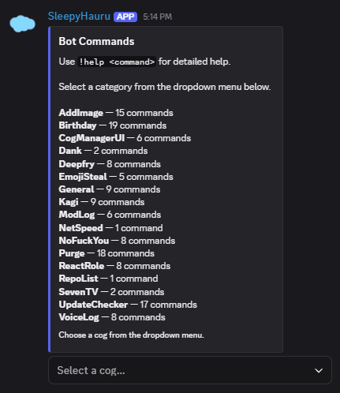
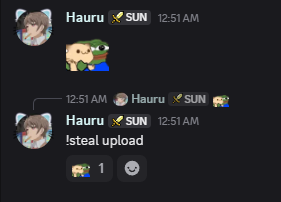
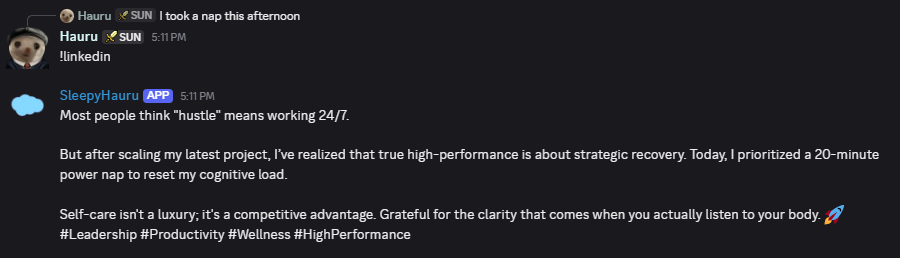
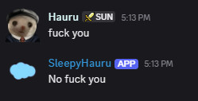
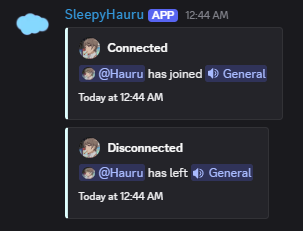

# sleepyhauru-cogs

This is an addon repo for [Red Discord Bot](https://github.com/Cog-Creators/Red-DiscordBot), built around the cogs I use on my own servers.

These cogs target Red 3.5-era installs and use modern Discord interaction features where it makes sense.

## Installation

To add one of these cogs to your instance of Red, run the following commands one by one (`[p]` is your prefix):

```text
[p]load downloader
[p]repo add sleepyhauru-cogs https://github.com/sleepyhauru/sleepyhauru-cogs
[p]cog install sleepyhauru-cogs [cog name]
[p]load [cog name]
```

You may be prompted to respond with `I agree` during install.

## Included Cogs

### AddImage (`addimage`)

Save uploaded media for the bot to upload later, similar to aliases but for attachments. Supports guild-specific images and videos, owner-managed global media, renaming, deletion, and per-guild size limits.

### Commands (`commands`)

Provides a single embedded command browser for selected installed cogs. Includes owner configuration for allow/deny lists and auto-discovery behavior.



### Deepfry (`deepfry`)

Applies deepfry or nuke filters to static images and GIFs. Supports attachments, direct links, replies, recent channel history, embeds, and member avatars. Includes auto-fry/auto-nuke odds, reply-only mode, and debug output.

### EmojiSteal (`emojisteal`)

Lets users steal emojis and stickers from replied-to messages, return their asset URLs, or upload them to the current server. Includes Discord context menus, `getemoji`, and mobile-friendly sticker upload flows.

Quick start:
- Reply to a message with `[p]steal` to get the asset URLs, or `[p]steal info` to preview what would be imported.
- Use `[p]steal upload` on a reply to import the emoji or sticker into the current server.
- If you want message context commands, enable them with `[p]slash enablecog emojisteal` and `[p]slash sync`.



### GuildAssets (`guildassets`)

Owner-only backup tools for server emojis and stickers. Export a guild's current assets into the bot's data folder, then import the latest export into another server with the same bot.

Quick start:
- In the source server, run `[p]guildassets export`.
- Check saved export history with `[p]guildassets list` or `[p]guildassets list <source_guild_id>`.
- In the destination server, run `[p]guildassets preview <source_guild_id>` to see what would be added or skipped.
- In the destination server, run `[p]guildassets import <source_guild_id>` and optionally pass a timestamp from the export list.

### Kagi (`kagi`)

Adds Kagi Translate tools, including `translate` (auto-detect to English), `translateinto <language>`, and the `linkedin` / `genz` style rewrites, plus owner-only setup and auth test commands. Custom Discord emoji are normalized before translation so they can be passed to Kagi cleanly.

Quick start:
- Load the cog, then configure it in DMs with `[p]kagi setkagi <value>` and `[p]kagi settranslate <value>`.
- Verify the saved auth with `[p]kagi test`, then use `[p]translate`, `[p]translateinto`, `[p]linkedin`, or `[p]genz`.
- If you want message context commands for translating or rewriting a specific message, enable them with `[p]slash enablecog kagi` and `[p]slash sync`.



### ModLog (`modlog`)

Tracks bans, unbans, kicks, joins, leaves, timeout changes, nickname and role updates, and cached message edits/deletes including bulk deletes, then posts them in a configured mod-log channel.

Quick start:
- Run `[p]modlog here` in the channel that should receive log entries.
- Verify the setup with `[p]modlog test`.
- Adjust audit matching with `[p]modlog auditwindow <seconds>` if moderation actions are being matched too loosely or too late.

### No Fuck You (`nofuckyou`)

Replies with `No fuck you` when someone says `fuck you`, with configurable odds, cooldowns, thirsty mode, and tracked stats. It starts disabled until enabled with `[p]nofuckyou enable`.



### SevenTV (`seventv`)

Uploads a Discord emoji from a 7TV link with `[p]7tv <link> [name]`, and inspects emotes with `[p]7tvinfo <link>`. Converts WEBP assets when needed so they can be uploaded to Discord.

### VoiceLog (`voicelog`)

Logs users joining, leaving, and moving between voice channels inside the voice channel's text chat. Includes per-event toggles and a configurable cooldown.


